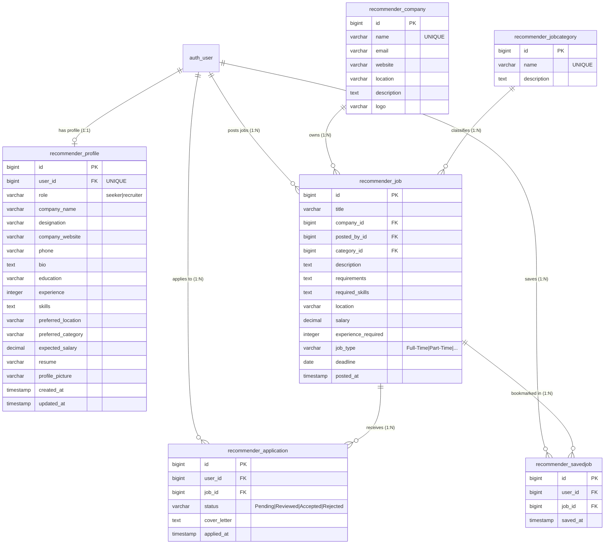

# Database Design & PostgreSQL Scalability Architecture

## 1. Overview
This document outlines the **database design, relational schema, indexing strategies, and PostgreSQL optimization techniques** for the **Job Recommendation Engine**.

To support high-throughput operations (e.g., millions of active job listings, user profiles, application submissions, and recommendation queries), the system is configured to use **PostgreSQL** as its enterprise Relational Database Management System (RDBMS).

---

## 2. Entity-Relationship Diagram (ERD)



---

## 3. High-Volume Performance & Indexing Strategy

### Single-Column B-Tree Indexes
B-Tree indexes reduce query complexity from $O(N)$ (full table scan) to $O(\log N)$ (index binary search lookup):

- `recommender_job.location`: Accelerates filtering by candidate location preference.
- `recommender_job.salary`: Optimizes range queries (`salary >= expected_salary`).
- `recommender_job.experience_required`: Speeds up filtering by candidate experience level (`experience >= experience_required`).
- `recommender_job.job_type`: Speeds up filtering by job type (Full-Time, Remote, etc.).
- `recommender_job.posted_at`: Accelerates pagination and recency-based recommendation feeds.
- `recommender_profile.role`: Speeds up role checks (`seeker` vs `recruiter`).
- `recommender_profile.preferred_location` & `preferred_category`: Accelerates recommendation matching.
- `recommender_application.status` & `applied_at`: Speeds up candidate dashboard and recruiter application tracking filters.

### Composite Indexes
Composite (multi-column) B-Tree indexes serve queries filtering on multiple constraints simultaneously:

1. **Job Search & Category Match Index**:
   ```sql
   CREATE INDEX recommender_job_loc_cat_idx ON recommender_job (location, category_id);
   ```
2. **Job Type & Salary Range Index**:
   ```sql
   CREATE INDEX recommender_job_type_sal_idx ON recommender_job (job_type, salary);
   ```
3. **Recommendation Feed Order Index**:
   ```sql
   CREATE INDEX recommender_job_posted_at_desc_idx ON recommender_job (posted_at DESC);
   ```
4. **Unique Integrity Constraints**:
   - `Application`: Composite Unique Index on `(user_id, job_id)` prevents duplicate applications and enables $O(1)$ lookup for existing user applications.
   - `SavedJob`: Composite Unique Index on `(user_id, job_id)`.

---

## 4. PostgreSQL Enterprise Scaling Strategies

When scaling the system to **millions of records**, apply the following PostgreSQL features:

### A. Connection Pooling (`CONN_MAX_AGE` & PgBouncer)
- **Problem**: Opening new DB TCP connections on every web request incurs high overhead.
- **Solution**: Set `CONN_MAX_AGE = 600` in Django settings to reuse database connections across requests. Use **PgBouncer** in transaction pooling mode for high concurrent load.

### B. PostgreSQL Full-Text Search (FTS) with `GIN` Indexing
For advanced skill and job description matching across millions of listings:
```sql
-- Add a TSVECTOR column for full-text search
ALTER TABLE recommender_job ADD COLUMN search_vector tsvector;

-- Create GIN index for full-text keyword queries
CREATE INDEX recommender_job_fts_idx ON recommender_job USING GIN(search_vector);
```

### C. PostgreSQL Table Partitioning (Range Partitioning)
For high-volume transaction logs like `Application` and analytics data, table partitioning can be enabled by year/month:
```sql
CREATE TABLE recommender_application_partitioned (
    id bigint NOT NULL,
    user_id bigint NOT NULL,
    job_id bigint NOT NULL,
    status varchar(20) NOT NULL,
    applied_at timestamp NOT NULL
) PARTITION BY RANGE (applied_at);

CREATE TABLE recommender_application_2026_Q3 PARTITION OF recommender_application_partitioned
    FOR VALUES FROM ('2026-07-01') TO ('2026-10-01');
```

---

## 5. Migration Guide: SQLite to PostgreSQL

### Step 1: Install PostgreSQL Adapter & Set Environment Variables
1. Ensure `psycopg2-binary` is installed:
   ```bash
   pip install -r requirements.txt
   ```
2. Copy `.env.example` to `.env` and fill in PostgreSQL details:
   ```ini
   DB_ENGINE=django.db.backends.postgresql
   DB_NAME=job_recommendation_db
   DB_USER=postgres
   DB_PASSWORD=your_secure_password
   DB_HOST=localhost
   DB_PORT=5432
   ```

### Step 2: Create PostgreSQL Database
Run in PostgreSQL client (psql / pgAdmin):
```sql
CREATE DATABASE job_recommendation_db;
```

### Step 3: Run Django Migrations
```bash
python manage.py makemigrations
python manage.py migrate
```

### Step 4: Data Transfer (Optional)
To dump data from SQLite and load into PostgreSQL:
```bash
# Export existing SQLite data
python manage.py dumpdata --natural-foreign --natural-primary -e contenttypes -e auth.Permission --indent 2 > datadump.json

# Import into PostgreSQL database
python manage.py loaddata datadump.json
```
